---

# Domain Architecture & Lab Setup

This section outlines the architecture and configuration of the Active Directory lab environment used throughout this project.

The goal was to simulate a small enterprise network with segmentation and realistic misconfigurations.

---

# 1️⃣ Network Architecture Overview

The lab consists of:

* Domain Controller (Windows Server)
* Workstation #1 (Dual-homed pivot host)
* Workstation #2 (Isolated subnet)
* Kali Linux attacker machine

### Logical Design

* Subnet A → DC + Workstation #1 (NIC 1)
* Subnet B (VMnet7) → Workstation #1 (NIC 2) + Workstation #2
* Attacker → Subnet A

📸 **Screenshots:**

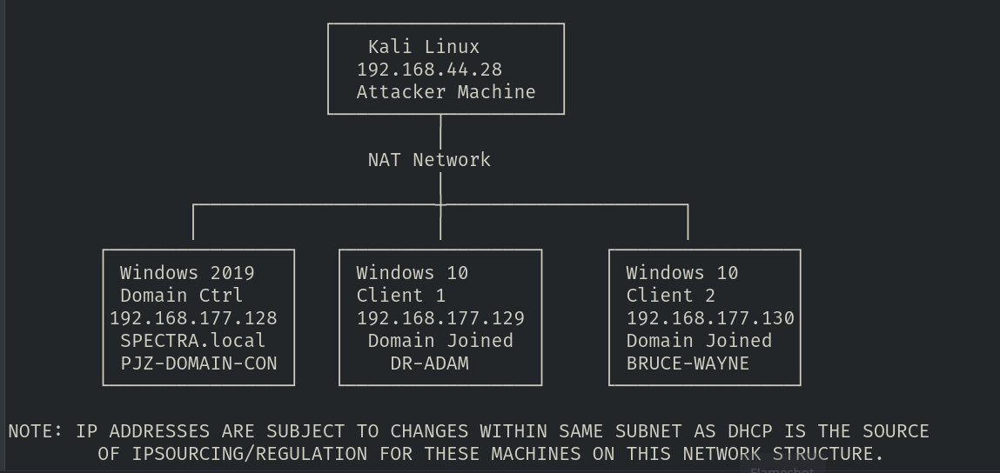

---

# 2️⃣ Virtual Network Configuration

Using VMware:

**Edit → Virtual Network Editor**

A new isolated network was created:

* VMnet7
* Separate subnet range
* Host-only configuration

This simulates an internal segmented network.

📸 **Screenshots:**

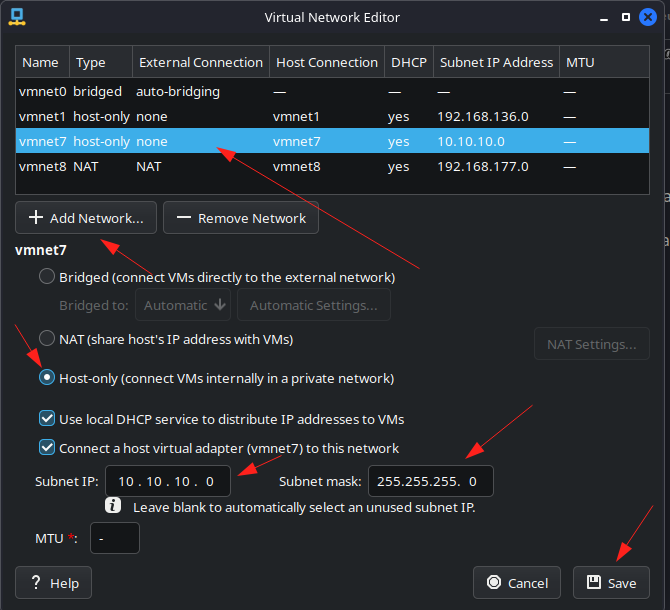

---

# 3️⃣ Machine Network Configuration

## Domain Controller

* Single NIC
* Subnet A
* Static IP assigned
* DNS configured to itself

📸 **Screenshots:**

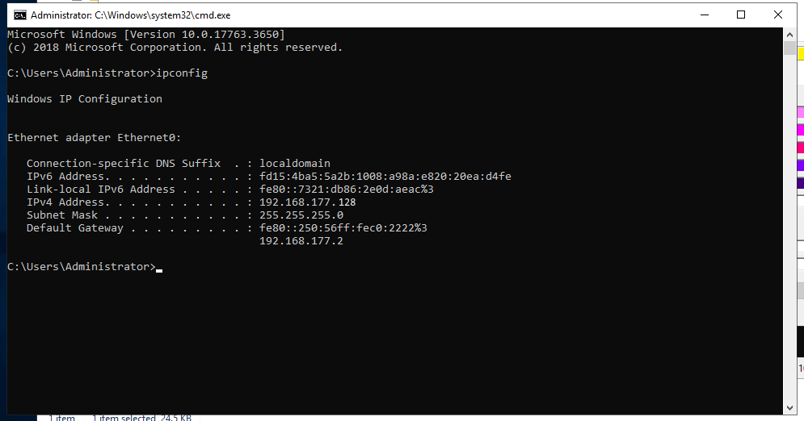

---

## Workstation #1 (Pivot Host)

Configured with **two NICs**:

* NIC 1 → Subnet A
* NIC 2 → VMnet7 (Subnet B)

This simulates a misconfigured enterprise workstation bridging two networks.

📸 **Screenshots:**

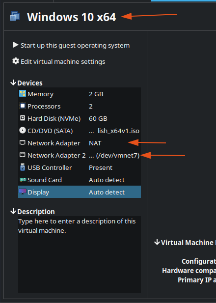
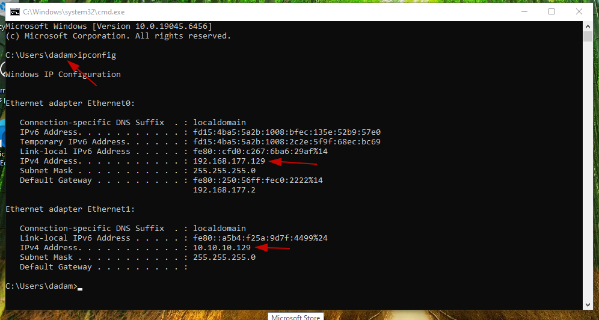

---

## Workstation #2 (Isolated Subnet)

* Single NIC
* Connected only to VMnet7
* Not directly reachable from attacker

📸 **Screenshots:**

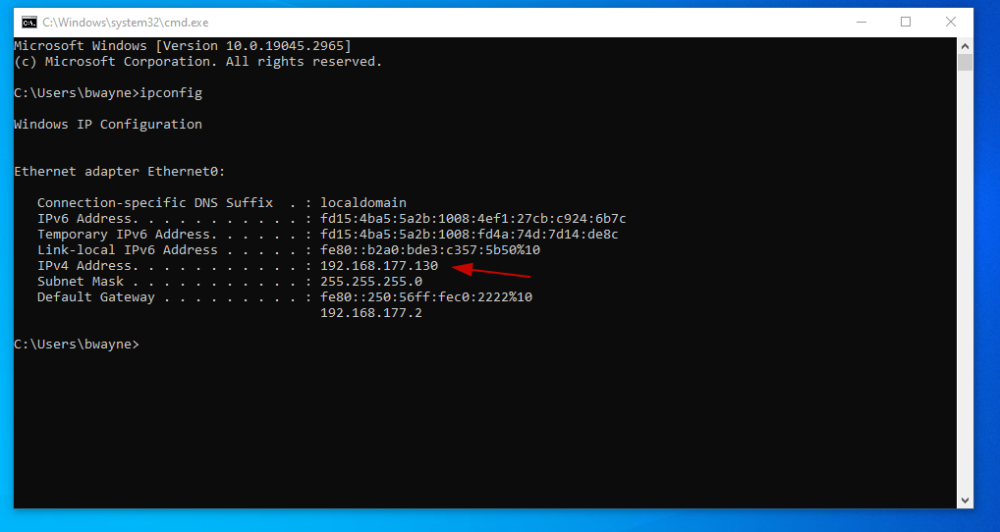
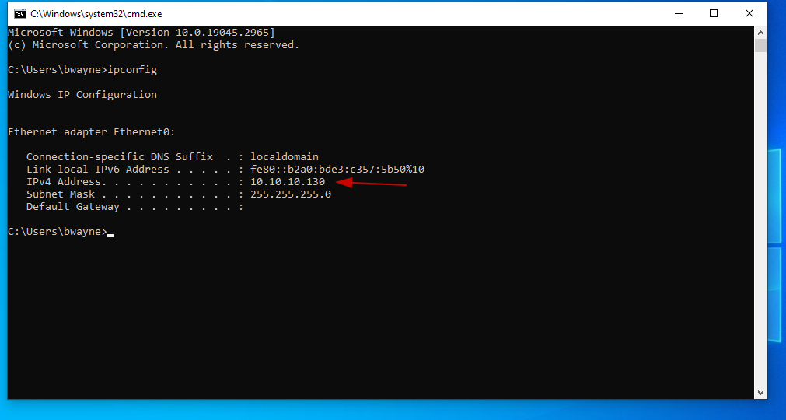
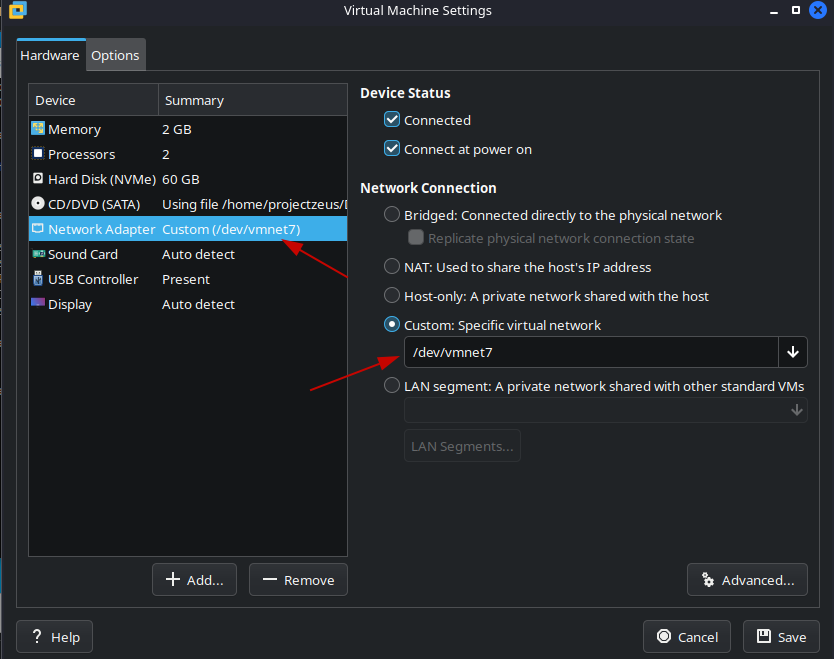

---

# 4️⃣ Firewall & Connectivity Configuration

To validate connectivity and allow testing:

Inbound rule enabled:

**File and Printer Sharing (Echo Request – ICMPv4-In)**

This allows ping testing.

📸 **Screenshots:**

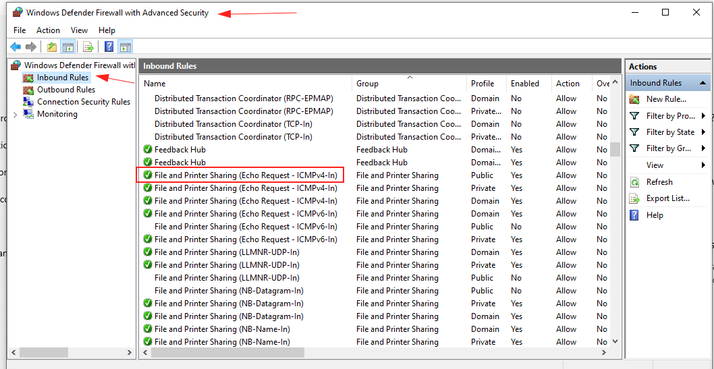

---

# 5️⃣ Connectivity Validation

From Kali Linux:

* Verified DC reachable
* Verified Workstation #1 reachable
* Verified Workstation #2 reachable (via segmentation logic)

Ping and IP configuration checks were performed.

📸 **Screenshot:**

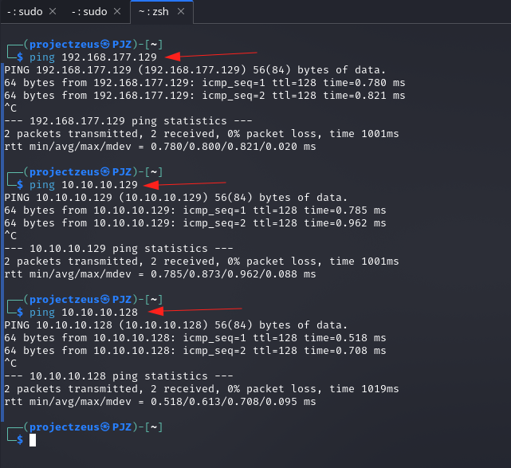
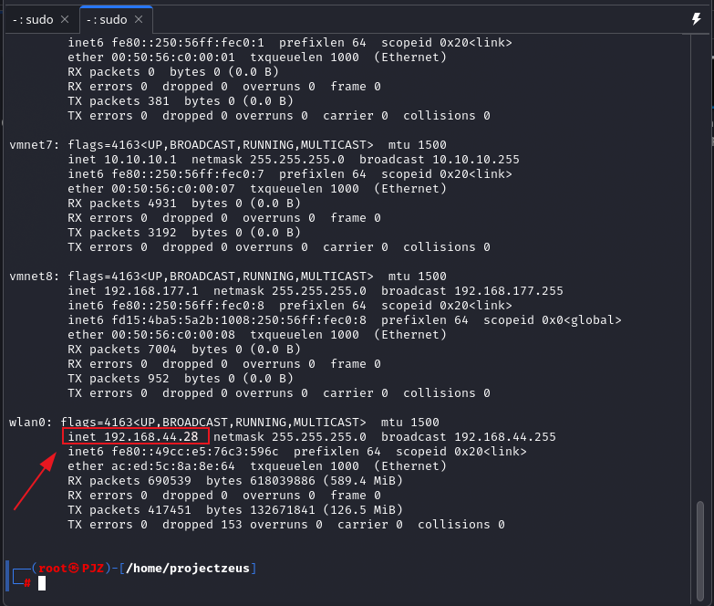

---

# Complete Architecture Summary and Process

The completed lab environment now simulates:

* Windows Server 2019 Domain Controller
* Two Windows 10 Pro client machines
* Domain users
* File shares
* Group Policies
* Controlled misconfigurations for attack simulation

---

# 1️⃣ Install Windows Server 2019

* Installed Windows Server 2019
* Renamed server for identification

📸 **Screenshots:**
```
screenshots/server-install/01-install.png
screenshots/server-install/02-rename-server.png
screenshots/server-install/03-renamed-server.png
...
```

---

# 2️⃣ Add Roles and Features

Installed:

* Active Directory Domain Services (AD DS)
* DNS Server

📸 **Screenshots:**

```
screenshots/add-roles/01-Server-add-roles.png
screenshots/add-roles/02-Server-add-roles.png
screenshots/add-roles/03-Server-add-roles.png
screenshots/add-roles/04-Server-add-roles.png
```

Include:

* Role selection
* Feature confirmation
* AD DS install progress
* DNS confirmation

---

# 3️⃣ Promote Server to Domain Controller

* Created new forest
* Configured domain name
* Set DSRM password
* Completed promotion

📸 **Screenshots:**

```
screenshots/promote-dc/01-promote-dc-to-server.png
screenshots/promote-dc/02-promote-dc-to-server.png
screenshots/promote-dc/03-promote-dc-to-server.png
screenshots/promote-dc/04-promoted-dc-to-server.png
```

Show:

* Forest creation
* Domain name setup
* Prerequisite check
* Successful promotion

---

# 4️⃣ Install Two Windows 10 Pro Client Machines

* Installed both client machines
* Assigned temporary workgroup setup

📸 **Screenshots:**

```
screenshots/client-install/01-installed.png
```

---

# 5️⃣ Rename Client Machines

* Changed PC names for identification
* Restarted systems

📸 **Screenshots:**

```
screenshots/client-rename/01-renamed.png
```

---

# 6️⃣ Configure Domain Controller

Performed initial domain configuration:

* Created Organizational Units (OUs)
* Created users
* Created security groups
* Configured basic policies

📸 **Screenshots:**

```
screenshots/dc-configuration/01-dc-config.png
screenshots/dc-configuration/02-dc-config.png
screenshots/dc-configuration/03-dc-config.png
screenshots/dc-configuration/04-dc-config.png
screenshots/dc-configuration/05-dc-config.png
screenshots/dc-configuration/06-dc-config.png
screenshots/dc-configuration/07-dc-config.png
```

---

# 7️⃣ Create File Share on Domain Controller

* Created shared folder
* Configured share permissions
* Set NTFS permissions
* Verified access

📸 **Screenshots:**

```
screenshots/dc-fileshare/01-dc-fileshare-setup.png
screenshots/dc-fileshare/02-dc-fileshare-setup.png
screenshots/dc-fileshare/03-dc-fileshare-setup.png
screenshots/dc-fileshare/04-dc-fileshare-setup.png
screenshots/dc-fileshare/05-dc-fileshare-setup.png
screenshots/dc-fileshare/06-dc-fileshare-setup.png
```

This simulates typical enterprise shared resources.

---

# 8️⃣ Create Service Principal Name (SPN)

Created SPN for Kerberoasting demonstration.

* Configured service account
* Assigned SPN to account

📸 **Screenshots:**

```
screenshots/spn-creation/01-SPN-setup.png
screenshots/spn-creation/02-SPN-setup.png
screenshots/spn-creation/03-SPN-setup.png
```

This prepares the lab for Kerberoasting attacks.

---

# 9️⃣ Configure Group Policy

Configured domain-level Group Policies:

* Disabled Windows Defender (for proof-of-concept attack demonstrations)
* Applied policies to domain systems

📸 **Screenshots:**

```
screenshots/dc-group-policy/01-dc-group-policy.png
screenshots/dc-group-policy/02-dc-group-policy.png
screenshots/dc-group-policy/03-dc-group-policy.png
screenshots/dc-group-policy/04-dc-group-policy.png
screenshots/dc-group-policy/05-dc-group-policy.png
screenshots/dc-group-policy/06-dc-group-policy.png
screenshots/dc-group-policy/07-dc-group-policy.png
screenshots/dc-group-policy/08-dc-group-policy.png
```

⚠ Note: Defender was disabled strictly for lab demonstration purposes.

---

# 🔟 Join Client Machines to Domain

### Step 1 – Create File Share on Clients

📸 **Screenshots:**

```
screenshots/client-fileshare/01-client-fileshare.png
screenshots/client-fileshare/02-client-fileshare.png
```

---

### Step 2 – Join Clients to Domain

Process included:

* Configure DNS to point to Domain Controller
* Resolve domain name
* Connect to domain (Work/School settings)

📸 **Screenshots DNS Resolution:**

```
screenshots/client-dns-config/01-client-dns-resolve.png
screenshots/client-dns-config/02-client-dns-resolve.png
screenshots/client-dns-config/03-client-dns-resolve.png
screenshots/client-dns-config/04-client-dns-resolve.png
screenshots/client-dns-config/05-client-dns-resolve.png
```

📸 **Screenshots Domain Join Process:**

```
screenshots/client-domain-join/01-connect-to-dc-work-sch.png
screenshots/client-domain-join/02-connect-to-dc-work-sch.png
screenshots/client-domain-join/03-connect-to-dc-work-sch.png
screenshots/client-domain-join/04-connect-to-dc-work-sch.png
screenshots/client-domain-join/05-connect-to-dc-work-sch.png
screenshots/client-domain-join/06-connect-to-dc-work-sch.png
```

---

# 1️⃣1️⃣ Configure Local Administrator Privileges

For SMB Relay demonstration:

* One domain user added as local admin on both client machines
* Another user added as local admin only on their respective machine

📸 **Screenshots:**

```
screenshots/local-admin-config/01-setuser-local-admin.png
screenshots/local-admin-config/02-setuser-local-admin.png
screenshots/local-admin-config/03-setuser-local-admin.png
```

This simulates common enterprise misconfiguration where users have administrative rights across multiple systems.

---

# Final Validation Screenshots

📸 **Screenshots:**

```
screenshots/final-state/01-client-machines.png
screenshots/final-state/02-All-Users.png
screenshots/final-state/03-Domain-Controler.png
```

Include:

* Domain Controller view (Active Directory Users & Computers)
* List of all users
* Client machines successfully joined to domain

---

# Lab Environment Summary

This configuration simulates a near-default enterprise Active Directory environment with:

* Domain services
* File shares
* Service accounts
* SPNs
* Group Policy configuration
* Multi-machine local admin reuse
* Domain-joined clients

The lab is intentionally structured to demonstrate:

* Credential attacks
* Kerberoasting
* SMB relay
* Privilege escalation
* Lateral movement
* Golden Ticket persistence
* Pivoting across subnets

---
